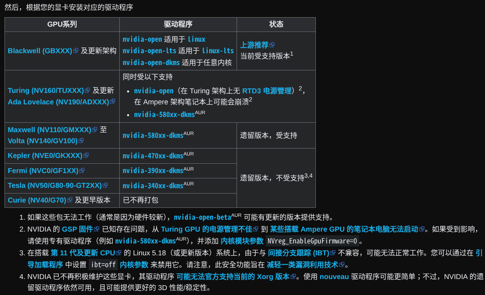

# NOT Toolbox Resource Document

> [!IMPORTANT]
> 请详细阅读[第四节](#四附加内容)内容。

> [!NOTE]
> 仓库目前处于早期阶段，可能有包的名称混淆或包名混乱，我们正在改进，也欢迎向本仓库贡献。  
> ~~救救孩子吧孩子真不想手搓了。~~

## 一、使用方式
### 1. URL构建
#### (1). 主URL
https://raw.githubusercontent.com/HOE-Team/not-toolbox-resource/refs/heads/main
#### (2). 追加
**Windows**
- Windows Winget:  
  `/windows/packages-windows-winget.json`
- Windows Scoop:  
  `/windows/packages-windows-scoop.json`
- Windows Chocolatey:  
  `/windows/packages-windows-chocolatey.json`  

**Linux**
- DNF:  
  `/linux/packages-linux-dnf.json`
- Pacman:  
  `/linux/packages-linux-pacman.json`
- APT:  
  `/linux/packages-linux-apt.json`
- Nix: 暂无
- Zypper: 暂无
- Emerge: 暂无

## 二、变量
| 字段 | 类型 | 作用 | 使用场景 |
|------|------|------|----------|
| name | String | 工具显示名称，在UI中展示给用户的工具名 | ToolsScreen 中列表显示、搜索匹配、CommonPackages 中作为缓存key（小写化后） |
| description | String? | 工具描述，中文说明该工具的用途 | 程序卡片显示 |
| url | String? | 官网/下载链接 | 用户点击"官网"按钮时打开浏览器跳转 |
| category | String? | 分类标签，用于工具分组 | getPackagesByCategory() 按分类分组展示，getCategories() 获取所有分类列表 |
| isProprietarySoftware | Boolean | 是否专有软件，默认false | UI中标记专有软件（如显示"专有"标签），合并时取逻辑或 |
| licenseUrl | String? | 许可证文件链接 | 开源工具显示许可证详情链接 |
| eulaUrl | String? | 最终用户许可协议链接 | 专有软件显示EULA链接（与licenseUrl互斥） |
| licenseType | String? | 许可证类型标识，如 GPL-2.0、MIT、Apache-2.0 | UI中显示许可证类型标签 |
| bucket | String? | **注意**: Scoop专有;程序所在的 Scoop 的软件仓库 | 在组合安装指令时使用<bucket>/<package>的格式 |
| wingetName | String? | Winget包管理器中的包名 | getPackageNameForManager(WINGET) 返回此值，用于 winget install --silent |
| scoopName | String? | Scoop包管理器中的包名 | getPackageNameForManager(SCOOP) 返回此值，用于 scoop install |
| chocolateyName | String? | Chocolatey包管理器中的包名 | getPackageNameForManager(CHOCOLATEY) 返回此值，用于 choco install -y |
| aptName | String? | APT包管理器中的包名 | getPackageNameForManager(APT) 返回此值，用于 sudo apt-get install -y |
| dnfName | String? | DNF包管理器中的包名 | getPackageNameForManager(DNF) 返回此值，用于 sudo dnf install -y |
| pacmanName | String? | Pacman包管理器中的包名 | getPackageNameForManager(PACMAN) 返回此值，用于 sudo pacman -S --noconfirm |
| zypperName | String? | Zypper包管理器中的包名 | 代码中已定义但JSON文件尚未创建 |
| emergeName | String? | Emerge包管理器中的包名 | 代码中已定义但JSON文件尚未创建 |
| nixName | String? | Nix包管理器中的包名 | 代码中已定义但JSON文件尚未创建 |

## 三、使用示例
模拟的演示环境：ArchLinux x86-64(pacman)、Python3

```python
#!/usr/bin/env python3
import json, subprocess
from urllib.request import urlopen

# 从RAW拉取
url = "https://raw.githubusercontent.com/HOE-Team/not-toolbox-resource/refs/heads/main/linux/packages-linux-pacman.json"
with urlopen(url, timeout=10) as resp:
    data = json.loads(resp.read().decode('utf-8'))
# 调用pacman安装第一个包
target = data[0]
pkg_name = target.get('pacmanName') or target['name']
cmd = f"sudo pacman -S --noconfirm {pkg_name}"

# 执行
subprocess.run(cmd.split())
```

## 四、附加内容
### 1. 关于 NVIDIA Linux 平台驱动程序的差别说明  
根据 ArchLinux Wiki 的说明， NVIDIA 驱动在 ArchLinux 差别较大且获取渠道不唯一，本程序仅提供 pacman 源的 nvidia-open 系列(包含nvidia-open、nvidia-open-lts、nvidia-open-dkms)，您需要安装机器内核匹配的版本并确认自己的 NVIDIA GPU 满足下图列表中对应的需求：

或访问ArchLinux Wiki原页面（中文）：https://wiki.archlinux.org.cn/title/NVIDIA

对于使用apt包管理器的用户，我们仅提供 nvidia-driver-assistant，用户需要自行使用
```bash
nvidia-driver-assistant --install
```
来安装对应设备的适合的驱动程序  
详情请参阅 Driver Helper Script - NVIDIA Docs: https://docs.nvidia.com/datacenter/tesla/driver-installation-guide/latest/driver-assistant.html

### 2. 关于包列表贡献事宜
您在贡献前，必须保证数据的安全性，准确性以及可读性，您需要遵守如下规则：
1. 不得向包列表加入具有有以下任何内容的软件包  
  a. 带有歧视的内容  
  b. 带有暴力、血腥、色情等不被法律所承认的非中性内容  
  c. 恶意软件包  
  d. 无法被当前包管理器识别的包或无效字段  
2. 需要限制下列内容进入软件包加入列表
  a. 孤儿包
  b. 有安全风险或出现过安全问题的包
  c. 许可不明确的包
  d. 与“工具”属性无关的包

### 3.仓库包列表问题提交
如果发现了任何问题，请向我们提交Issue  
如果发现了严重的安全问题，请立即停止使用，联系我们的邮箱 hoe_software_team@outlook.com，并尽可能扩散此安全警报。  
1. #### 接受的Issue类型：  
    a. 包失效  
    b. 包变更  
    c. 安全问题  
    d. 请求添加  
2. #### 拒绝的情况
    a. 请求不明确，描述不清晰  
    b. 辱骂、广告等垃圾内容  
    c. 重复问题  

## 五、许可协议
本仓库基于MIT协议开放，你可以在保留原作者署名的前提下，自由使用本仓库内的所有JSON文件，包括但不限于复制、修改、合并、发布、分发、再许可及商业用途。  
版权所有 ©2026 HOE Team.保留所有权利。

## 六、免责声明
HOE Team(以下简称“本团队”)仅对本团队维护的软件包列表 HOE-Team/not-toolbox-resource 有管理及解释权，对于第三方修改的包列表，使用者需要自行甄辨其安全性，若使用第三方包列表导致任何安全或软件稳定问题，本团队一律不负责。